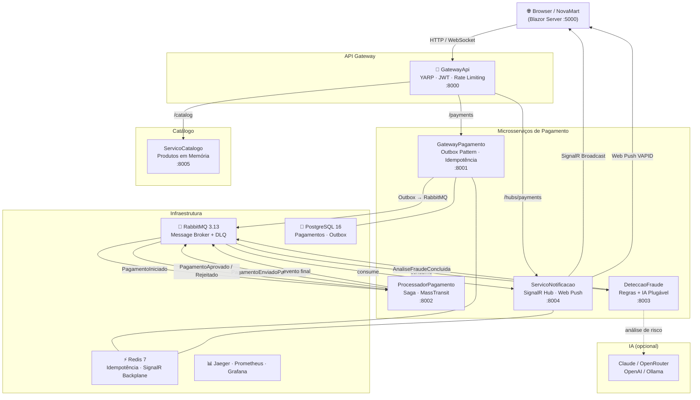

<div align="center">

# 🏦 FinovaTech + 🛒 NovaMart

**Plataforma de microsserviços para processamento de pagamentos internacionais com detecção de fraude por IA e e-commerce em tempo real**

[](https://dotnet.microsoft.com/)
[](https://blazor.net)
[](https://masstransit.io)
[](https://rabbitmq.com)
[](https://redis.io)
[](https://postgresql.org)
[](https://docker.com)
[](https://opentelemetry.io)
[](LICENSE)

<br/>

> Demo screenshot: rode `docker compose up -d` e acesse [http://localhost:5000](http://localhost:5000)

</div>

---

## 📋 Sobre o Projeto

Este repositório contém dois tech challenges integrados que demonstram arquitetura enterprise em .NET 10:

### 🏦 FinovaTech — Backend de Pagamentos

Plataforma de microsserviços resiliente para **processamento de pagamentos internacionais** com conversão de moedas. Implementa Outbox Pattern, Saga com MassTransit, detecção de fraude por IA plugável, idempotência via Redis e observabilidade completa com OpenTelemetry.

Todos os microsserviços se comunicam **exclusivamente via eventos RabbitMQ** — zero chamadas HTTP diretas entre serviços de pagamento.

### 🛒 NovaMart — E-commerce Dark Tech

Loja de hardware com visual "dark tech" construída em Blazor Server que usa o FinovaTech como meio de pagamento. Exibe o status do pagamento em tempo real via SignalR e envia Web Push Notifications (VAPID) mesmo com o browser fechado.

> Este projeto foi desenvolvido como tech challenge para demonstrar padrões enterprise de microsserviços em .NET 10: event-driven architecture, resiliência, observabilidade e UX em tempo real.

---

## ✨ Funcionalidades

| | Funcionalidade | Descrição |
|---|---|---|
| ✅ | **Event-Driven Architecture** | Microsserviços desacoplados via RabbitMQ — zero chamadas HTTP diretas. Outbox Pattern + Dead Letter Queues. |
| ✅ | **Saga com MassTransit** | Orquestração stateful do fluxo completo de pagamento com estado persistido e compensação automática. |
| ✅ | **IA Plugável na Detecção de Fraude** | Claude (Anthropic), OpenRouter, OpenAI ou Ollama — troque o provedor via variável de ambiente, sem alterar código. |
| ✅ | **Status em Tempo Real** | SignalR atualiza a timeline do pedido no browser sem polling: Pendente → Em Análise → Aprovado/Rejeitado. |
| ✅ | **Web Push Notifications** | Notificação nativa do sistema operacional via VAPID — funciona mesmo com o browser fechado. |
| ✅ | **Observabilidade Completa** | OpenTelemetry → Jaeger (traces distribuídos), Prometheus + Grafana (métricas), Serilog (logs JSON estruturados). |
| ✅ | **Grafana Alerting** | 5 regras de alerta provisionadas automaticamente: serviço fora do ar, DLQ acumulando, taxa de erro > 10%, latência p99 > 2s, consumer MassTransit falhando. Notificação via Discord/Slack webhook. |
| ✅ | **YARP API Gateway** | Roteamento inteligente, autenticação JWT centralizada, Rate Limiting por IP e timeout global. |
| ✅ | **Idempotência com Redis** | ChaveIdempotencia com TTL de 24h garante que o mesmo pagamento nunca seja processado duas vezes. |
| ✅ | **Resiliência com Polly v8** | Retry com backoff exponencial, Circuit Breaker, Timeout e Bulkhead em todos os serviços. |
| ✅ | **Stack completa em um comando** | `docker compose up -d` sobe toda a infraestrutura em segundos. |

---

## 🏗️ Arquitetura



### Eventos de Domínio

| Evento | Publicado por | Consumido por |
|---|---|---|
| `PagamentoIniciado` | GatewayPagamento | ProcessadorPagamento |
| `PagamentoEnviadoParaAnalise` | ProcessadorPagamento | DeteccaoFraude |
| `AnaliseFraudeConcluida` | DeteccaoFraude | ProcessadorPagamento |
| `PagamentoAprovado` | ProcessadorPagamento | ServicoNotificacao |
| `PagamentoRejeitado` | ProcessadorPagamento | ServicoNotificacao |

---

## 💳 Fluxo de Pagamento — 9 Passos

```
1.  Browser → POST /payments  (header: Idempotency-Key: {uuid})
                │
2.  GatewayApi  → valida JWT → roteia para GatewayPagamento
                │
3.  GatewayPagamento:
     ├── verifica ChaveIdempotencia no Redis (TTL 24h)
     └── transação atômica PostgreSQL:
          INSERT Pagamentos   (situacao = Pendente)
          INSERT RegistrosOutbox (publicado = false)
          COMMIT
                │
4.  RelayOutbox (IHostedService) → publica PagamentoIniciado no RabbitMQ
     └── UPDATE RegistrosOutbox SET publicado = true
                │
5.  ProcessadorPagamento consome PagamentoIniciado
     └── publica PagamentoEnviadoParaAnalise
                │
6.  DeteccaoFraude consome PagamentoEnviadoParaAnalise
     ├── avalia regras de negócio (valor, moeda, histórico)
     ├── consulta IA plugável (se configurada)
     └── publica AnaliseFraudeConcluida  (aprovado/reprovado)
                │
7.  ProcessadorPagamento consome AnaliseFraudeConcluida
     └── publica PagamentoAprovado OU PagamentoRejeitado
                │
8.  ServicoNotificacao consome evento final
     ├── envia Web Push Notification (VAPID)
     └── broadcast via SignalR Hub
                │
9.  Browser atualiza LinhaDoTempoStatus em tempo real:
     🟡 Pendente → 🔵 Em Análise → ✅ Aprovado / ❌ Rejeitado
```

---

## 🛠️ Tech Stack

| Categoria | Tecnologia | Versão |
|---|---|---|
| **Runtime** | .NET | 10.0 |
| **Frontend** | Blazor Server | .NET 10 |
| **API Gateway** | YARP Reverse Proxy | 2.x |
| **Message Broker** | RabbitMQ | 3.13 |
| **Mensageria** | MassTransit | 8.2.5 |
| **ORM / Banco** | EF Core + PostgreSQL | 10 / 16 |
| **Cache & Idempotência** | Redis | 7 |
| **IA (plugável)** | Anthropic Claude / OpenRouter / OpenAI / Ollama | — |
| **Resiliência** | Polly v8 | 8.x |
| **Tracing distribuído** | OpenTelemetry → Jaeger | 1.58 |
| **Métricas** | Prometheus + Grafana | 2.53 / 11.1 |
| **Logging** | Serilog (JSON estruturado) | 10.x |
| **Estilos** | Tailwind CSS (CDN) + Font Awesome 6 | — |
| **Real-time** | SignalR | .NET 10 |
| **Push Notifications** | Web Push VAPID | — |
| **Containerização** | Docker + Docker Compose | — |
| **Testes** | xUnit + TDD | — |

---

## 🗂️ Serviços

| Serviço | Responsabilidade | Porta | Tipo |
|---|---|---|---|
| **GatewayApi** | Roteamento YARP, autenticação JWT, Rate Limiting por IP | 8000 | Minimal API |
| **GatewayPagamento** | Recebe pedidos, Outbox Pattern, idempotência Redis | 8001 | Minimal API |
| **ProcessadorPagamento** | Consome eventos, orquestra Saga, publica resultados | 8002 | Worker + ASP.NET |
| **DeteccaoFraude** | Análise de risco com regras e IA plugável | 8003 | Worker + ASP.NET |
| **ServicoNotificacao** | SignalR Hub, Web Push VAPID, notificações em tempo real | 8004 | Worker + ASP.NET |
| **ServicoCatalogo** | Catálogo de 20+ produtos de hardware em memória | 8005 | Minimal API |
| **NovaMart.Frontend** | E-commerce Blazor Server — fluxo completo de compra | 5000 | Blazor Server |

> Todos os workers expõem `/health` e `/metrics` via ASP.NET Core embutido.

---

## 🚀 Como Executar

### Pré-requisitos

- [Docker Desktop](https://www.docker.com/products/docker-desktop/) 4.24+
- Git

### 1 — Clone o repositório

```bash
git clone https://github.com/Vitor-Henrique-EM/finovatech.git
cd finovatech
```

### 2 — Suba a stack completa

```bash
docker compose up -d
```

> O primeiro build pode demorar alguns minutos (download das imagens + compilação .NET 10).

### 3 — Acesse os serviços

| Serviço | URL | Credenciais |
|---|---|---|
| 🛒 **NovaMart** | http://localhost:5000 | admin@novamart.com / 123456 |
| 🔌 **GatewayApi** | http://localhost:8000 | — |
| 🐇 **RabbitMQ Management** | http://localhost:15672 | finovatech / finovatech123 |
| 📡 **Jaeger UI** | http://localhost:16686 | — |
| 📊 **Prometheus** | http://localhost:9090 | — |
| 📈 **Grafana** | http://localhost:3000 | admin / finovatech123 |
| 🐘 **PostgreSQL** | localhost:15432 | finovatech / finovatech123 |

### 4 — Parar os containers

```bash
.\stop.ps1          # PowerShell (Windows)
docker compose down # qualquer plataforma
```

### 5 — Restart limpo (apaga volumes)

```bash
.\restart.ps1       # PowerShell (Windows)
```

---

## ⚙️ Configuração

### Detecção de Fraude por IA (opcional)

Sem configuração, o sistema usa apenas regras de negócio determinísticas. Para ativar a análise por IA, defina as variáveis de ambiente antes de subir os containers:

```bash
# Anthropic Claude (recomendado para produção)
PROVEDOR_IA=Anthropic
MODELO_IA=claude-opus-4-8
APIKEY_IA=sk-ant-...

# OpenRouter (acesso a dezenas de modelos com uma única API key)
PROVEDOR_IA=OpenRouter
MODELO_IA=anthropic/claude-opus-4-5
APIKEY_IA=sk-or-...
BASEURL_IA=https://openrouter.ai/api/v1

# OpenAI
PROVEDOR_IA=OpenAI
MODELO_IA=gpt-4o
APIKEY_IA=sk-...

# Ollama (local, gratuito, sem internet — ideal para desenvolvimento)
PROVEDOR_IA=Ollama
MODELO_IA=llama3.2
BASEURL_IA=http://host.docker.internal:11434/v1
```

### Web Push Notifications (VAPID)

As chaves VAPID de desenvolvimento já estão pré-configuradas no `docker-compose.yml`. Para produção, gere um novo par de chaves:

```bash
# Node.js — gera par de chaves VAPID EC P-256
node -e "
const crypto = require('crypto');
const { publicKey, privateKey } = crypto.generateKeyPairSync('ec', {
  namedCurve: 'prime256v1',
  publicKeyEncoding:  { type: 'spki',  format: 'der' },
  privateKeyEncoding: { type: 'pkcs8', format: 'der' }
});
console.log('VAPID_PUBLIC_KEY=',  publicKey.slice(23).toString('base64url'));
console.log('VAPID_PRIVATE_KEY=', privateKey.slice(36).toString('base64url'));
"
```

Adicione as chaves geradas às variáveis de ambiente do `ServicoNotificacao`:

```yaml
# docker-compose.yml (trecho)
serviço-notificacao:
  environment:
    VAPID__PublicKey: "SUA_CHAVE_PUBLICA"
    VAPID__PrivateKey: "SUA_CHAVE_PRIVADA"
    VAPID__Subject: "mailto:contato@seudominio.com"
```

---

## 📊 Observabilidade

O projeto implementa observabilidade de ponta a ponta com `CorrelacaoId` propagado em todos os headers HTTP e mensagens RabbitMQ.

### Jaeger — Traces Distribuídos

Acesse **http://localhost:16686** para rastrear qualquer pagamento do primeiro request HTTP até o último evento.

```
Pesquise por:  Service = finovatech-gateway-pagamento
               Tag     = correlacao.id = {id-do-pagamento}
```

### Prometheus — Métricas

Acesse **http://localhost:9090** para consultar métricas em tempo real.

Métricas expostas por todos os serviços via `/metrics`:
- `pagamentos_processados_total` — volume por status
- `pagamento_latencia_segundos` — histogram p50/p95/p99
- `circuit_breaker_estado` — estado atual (fechado/aberto/meio-aberto)
- `rabbitmq_fila_profundidade` — mensagens aguardando por fila

### Grafana — Dashboards e Alertas

Acesse **http://localhost:3000** (admin / finovatech123) para visualizar os 3 dashboards provisionados automaticamente:

| Dashboard | O que mostra |
|---|---|
| **Pagamentos** | Volume, latência p50/p95/p99, taxa de erro por serviço |
| **Circuit Breaker** | Estado de cada breaker em tempo real |
| **Filas RabbitMQ** | Profundidade das filas e mensagens nas DLQs |

### Grafana Alerting — Notificações Proativas

5 regras de alerta provisionadas via `infra/grafana/provisioning/alerting/`:

| Regra | Condição | Severidade |
|---|---|---|
| **Serviço Indisponível** | `up == 0` por mais de 1 min | Crítica |
| **DLQ com Mensagens** | Qualquer fila `*.dlq` com mensagens por 2 min | Crítica |
| **Taxa de Erro > 10%** | Erros HTTP 5xx > 10% em 5 min | Alta |
| **Latência p99 > 2s** | p99 acima de 2s por 5 min | Alta |
| **Consumer Falhando** | `masstransit_receive_fault_total` > 0 por 2 min | Alta |

Para ativar as notificações por email, configure as variáveis de ambiente antes de subir os containers:

```bash
# Gmail (recomendado para testes — use uma App Password, não a senha da conta)
export SMTP_HOST="smtp.gmail.com:587"
export SMTP_USER="seu@gmail.com"
export SMTP_PASSWORD="sua-app-password"
export SMTP_FROM="seu@gmail.com"
export ALERT_EMAIL_TO="destino@email.com"

docker compose up -d
```

> **Gmail App Password:** Acesse [myaccount.google.com/apppasswords](https://myaccount.google.com/apppasswords), gere uma senha para "Mail" e use-a como `SMTP_PASSWORD`. A autenticação de dois fatores precisa estar ativa.

Para outros provedores:

```bash
# Outlook / Office 365
export SMTP_HOST="smtp.office365.com:587"

# SendGrid
export SMTP_HOST="smtp.sendgrid.net:587"
export SMTP_USER="apikey"
export SMTP_PASSWORD="SUA_SENDGRID_API_KEY"

# Servidor SMTP interno sem TLS
export SMTP_HOST="seu-smtp:25"
export SMTP_SKIP_VERIFY="true"
```

Discord é suportado como canal secundário opcional:

```bash
export DISCORD_WEBHOOK_URL="https://discord.com/api/webhooks/SEU_ID/SEU_TOKEN"
```

As regras são provisionadas automaticamente — não é necessário configurar nada na UI do Grafana.

> **Extensível para qualquer canal:** o Grafana Alerting suporta nativamente Slack, Discord, Microsoft Teams, PagerDuty, OpsGenie, Telegram, Webhook genérico e outros. Para trocar ou adicionar um canal, edite `infra/grafana/provisioning/alerting/contact-points.yml` com o tipo desejado e reinicie o container do Grafana — sem alterar nenhuma regra de alerta.

---

## 📁 Estrutura do Projeto

```
Finovatech/
├── src/
│   ├── Finovatech.Contratos/              # Eventos compartilhados (records imutáveis + EventoBase)
│   │   ├── PagamentoIniciado.cs
│   │   ├── PagamentoEnviadoParaAnalise.cs
│   │   ├── AnaliseFraudeConcluida.cs
│   │   ├── PagamentoAprovado.cs
│   │   └── PagamentoRejeitado.cs
│   │
│   ├── Finovatech.GatewayApi/             # YARP + JWT + Rate Limiting
│   │   ├── Program.cs
│   │   └── appsettings.json               # Configuração YARP e rotas
│   │
│   ├── Finovatech.GatewayPagamento/       # Outbox Pattern + Idempotência
│   │   ├── Dominio/                       # Entidade Pagamento, SituacaoPagamento
│   │   ├── Aplicacao/CasosDeUso/          # CriePagamentoHandler
│   │   ├── Infraestrutura/                # ContextoPagamento, RelayOutbox
│   │   └── Api/Endpoints/                 # POST /payments, GET /payments/{id}
│   │
│   ├── Finovatech.ProcessadorPagamento/   # Saga + Orquestração de eventos
│   │   ├── Dominio/
│   │   ├── Aplicacao/
│   │   ├── Infraestrutura/Mensageria/
│   │   └── Worker/Consumidores/
│   │
│   ├── Finovatech.DeteccaoFraude/         # Regras de negócio + IA plugável
│   │   ├── Dominio/Servicos/              # ServicoAnaliseRisco
│   │   ├── Infraestrutura/IA/             # IClienteIA, ClienteAnthropic, ClienteOllama...
│   │   └── Worker/Consumidores/
│   │
│   ├── Finovatech.ServicoNotificacao/     # SignalR Hub + Web Push VAPID
│   │   ├── Worker/Hubs/                   # HubPagamentos.cs
│   │   ├── Worker/Consumidores/
│   │   └── Infraestrutura/WebPush/        # ServicoWebPush
│   │
│   ├── Finovatech.ServicoCatalogo/        # Catálogo de 20+ produtos em memória
│   │   ├── Dominio/Entidades/             # Produto, Categoria
│   │   └── Api/Endpoints/                 # GET /catalog, GET /catalog/{id}
│   │
│   └── NovaMart.Frontend/                 # Blazor Server — e-commerce dark tech
│       ├── Paginas/                        # Uma .razor por rota
│       ├── Compartilhados/                 # BarraNavegacao, CartaoProduto...
│       ├── Servicos/                       # ServicoCarrinho, ServicoAutenticacao, ServicoHubPedido
│       ├── Modelos/                        # DTOs de view
│       ├── Autenticacao/                   # ProvedorEstadoAutenticacao
│       └── wwwroot/app.css                 # Tailwind + variáveis dark theme
│
├── infra/
│   ├── docker-compose.yml                 # Stack completa de infraestrutura
│   ├── docker-compose.override.yml        # Overrides para desenvolvimento local
│   ├── prometheus/prometheus.yml          # Configuração de scrape
│   └── grafana/provisioning/              # Datasources, dashboards e alertas provisionados
│       ├── alerting/                      # contact-points, notification-policies, alert-rules
│       ├── dashboards/                    # 3 dashboards JSON
│       └── datasources/                   # Prometheus datasource
│
├── docs/
│   ├── superpowers/specs/                 # Documento de arquitetura aprovado
│   └── superpowers/plans/                 # Planos de implementação
│
├── docker-compose.yml                     # Entry point (Visual Studio / raiz)
├── restart.ps1                            # Restart limpo (apaga volumes)
├── stop.ps1                               # Parada limpa
└── Finovatech.sln
```

---

## 🏛️ Decisões Arquiteturais

### Por que Event-Driven puro?
Cada microsserviço conhece apenas os contratos de evento definidos em `Finovatech.Contratos`. Nenhum serviço conhece o endereço HTTP de outro. Isso permite escalar, substituir ou adicionar serviços sem alterar os existentes — o desacoplamento é real, não apenas teórico.

### Por que Outbox Pattern?
Publicar diretamente no RabbitMQ dentro da request HTTP perde eventos se o broker estiver indisponível no momento do `Commit`. Com o Outbox, o evento é persistido na mesma transação do banco de dados. O `RelayOutbox` (`IHostedService`) entrega o evento com garantia — mesmo após restart do container.

### Por que MassTransit 8.2.5?
A versão 8.3.6+ requer licença comercial para uso em produção. A 8.2.5 é a última versão sob MIT License — escolha deliberada para manter o projeto open source.

### Por que Cookie HttpOnly para o JWT?
JavaScript não consegue ler cookies `HttpOnly` — proteção nativa contra ataques XSS. Usar `localStorage` exporia o token a qualquer script injetado na página. O `ServicoAutenticacao` renova o token silenciosamente 5 minutos antes do vencimento.

### Por que IA plugável?
Detecção de fraude por LLM tem custo e latência. A interface `IClienteIA` permite usar um modelo caro (Claude Opus) para pagamentos de alto valor e um modelo local gratuito (Ollama + Llama) para os demais — tudo configurado por variável de ambiente, sem alterar uma linha de código.

### Por que Dead Letter Queues?
Mensagens que falham repetidamente (ex: bug no consumer, schema inválido) não podem travar a fila principal. Cada fila tem uma DLQ associada para inspeção e reprocessamento manual sem impacto no fluxo principal.

### Por que Workers expõem `/health` e `/metrics`?
Workers recebem trabalho via fila, não via HTTP — mas ainda precisam de observabilidade. O ASP.NET Core embutido expõe esses endpoints sem transformar o Worker em uma API completa.

---

## 📄 Licença

Distribuído sob a licença MIT. Veja [LICENSE](LICENSE) para mais detalhes.

---

<div align="center">

Feito com ☕ e muito `dotnet build` por **Vitor Henrique**

[](https://linkedin.com/in/vitor-henrique-em)
[](https://github.com/Vitor-Henrique-EM)

</div>
